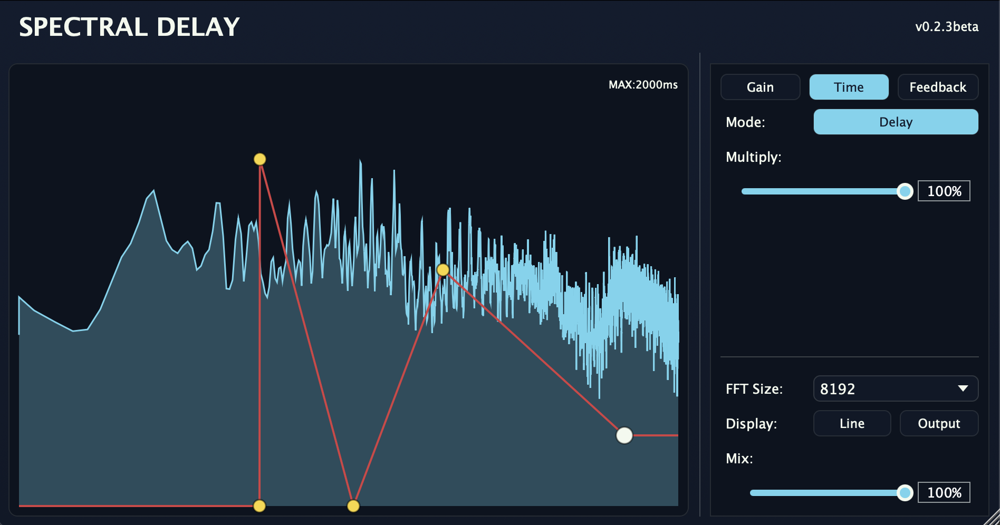

# CopyCat Spectral Delay

[English](#english) | [中文](#中文)

---

## English

### Overview

**CopyCat Spectral Delay** is a spectral audio effect plugin that processes audio through STFT (Short-Time Fourier Transform) and applies independent parameters to each frequency bin. Create unique delay, gain, and feedback effects that vary across the frequency spectrum.

### Screenshot



### Features

| Feature | Description |
|---------|-------------|
| **Per-Bin Delay** | Apply different delay times to different frequency bands |
| **Per-Bin Gain** | Apply different gain values to different frequency bands |
| **Per-Bin Feedback** | Control feedback amount per frequency band |
| **Phase/Delay Mode** | Switch between phase rotation and actual delay modes |
| **Real-time Spectrum Display** | View input or output spectrum in real-time |
| **Multi-point Curve Editor** | Click to add points, drag to move, double-click to delete |
| **FFT Size** | Adjustable from 256 to 8192 |
| **Dry/Wet Mix** | Blend between original and processed signal |
| **Parameter Multipliers** | Separate multiply sliders for Gain, Delay, and Feedback |
| **Feedback Phase Invert** | Invert feedback signal phase |
| **Line/Bar Display** | Toggle between line and bar chart visualization |


> [!NOTE]
> This plugin is currently **unsigned**. On first launch, you may need to manually allow it in your system security settings.

### Installation

#### Download
Download the latest release from [GitHub Releases](https://github.com/CopycatMusic/Spectral-Delay-beta-release/releases/tag/v0.2.3beta).

#### Installation Paths

**macOS:**
```
~/Library/Audio/Plug-Ins/VST3/
```

**Windows:**
```
C:\Program Files\Common Files\VST3\
```

### Usage

The plugin interface is divided into two main sections:

#### Left Panel - Spectrum Display & Curve Editor
- **Spectrum Visualization**: Real-time FFT magnitude display (logarithmic frequency scale)
- **Curve Editing**:
  - **Single-click**: Add a control point
  - **Drag**: Move a control point
  - **Double-click**: Delete a control point

#### Right Panel - Control Panel
- **Parameter Selection**: Choose between Gain, Time (Delay), or Feedback
- **Mode Toggle**: Switch between Phase and Delay modes
- **Multiply Sliders**: Scale the effect of each parameter (0-100%)
- **FFT Size**: Select FFT window size (256-8192)
- **Display options**: Toggle between Line and Bar visualization, Switch between Input and Output spectrum display
- **Mix**: Dry/Wet balance control

### License

**All Rights Reserved** © 2025 CopyCat

This software is provided for personal use only. Redistribution or modification without permission is prohibited.

### Acknowledgements

*Coming soon*

---

## 中文

### 概述

**CopyCat Spectral Delay**是一款**频谱音频效果器插件**

### 界面截图

<!-- TODO: 添加截图 -->
*截图即将添加*

> [!NOTE]
> 本插件目前**未签名**。首次运行时，可能需要在系统安全设置中手动允许运行。

### 安装

#### 安装路径

**macOS：**
```
~/Library/Audio/Plug-Ins/VST3/
```

**Windows：**
```
C:\Program Files\Common Files\VST3\
```


### licence

**All Rights Reserved** © 2025 CopyCat

This software is provided for personal use only. Redistribution or modification without permission is prohibited.
本软件仅供个人使用。未经许可不得重新分发或修改。

### 致谢

*即将添加*
